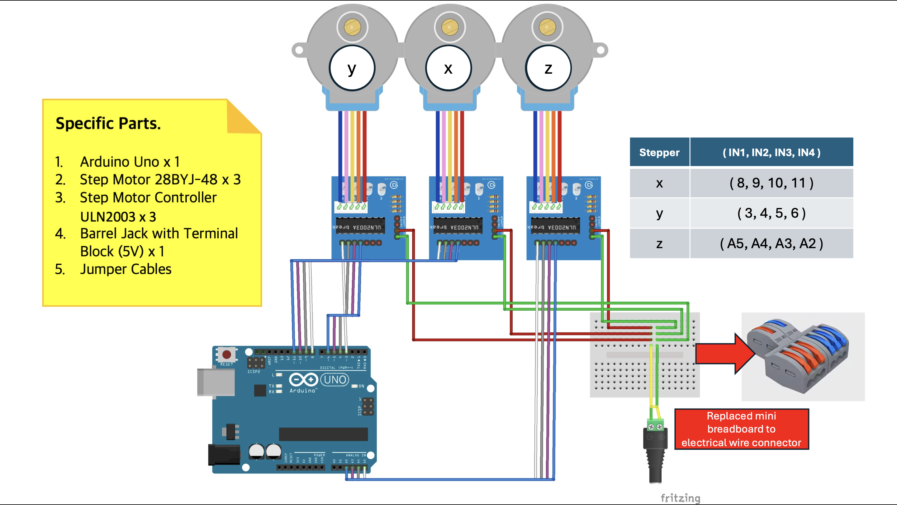

## Develop Language 
  

## Information
**Creator** : Jimin Lee, Seungyeon Lee, Hyunseo Kim  
**Date** : 2024-12-23  
**Version** : 0.1.0  

# CNC Robot 
## Circuit 

## Blue Print 

## Assembled Img 

## Reference 
1. Get STL file : https://www.thingiverse.com/thing:4579436/files   
2. How to assemble : https://www.youtube.com/watch?v=WtUIBxfddjw&list=LL&index=19
